# Run Report — galatea 发布就绪

> 本次循环的**流程总览**：这一程是怎么从「未达标」一步步走到「收敛」的。
> 逐条结案见 `final-review.md`；append-only 流水见 `log.md`；待决策提案见 `pending.md`。

---

## 一句话摘要

目标「galatea 达到可开源发布质量」，经 **Phase 0 冻结 + 2 个活跃轮**，在两次对抗式验收的阻断与补修后，R1-R8 八项 rubric 全绿，`.done` 落盘、引擎正常退出。

| 项 | 值 |
|----|----|
| 运行日期 | 2026-06-26 |
| 起止时间 | 02:14 → 03:08，共约 54 分钟（取首个/末个 commit 时间）|
| 退出方式 | **达标收敛**（非熔断 / 非轮数耗尽）|
| 流程轮次 | Phase 0 → R1 → R2 → 收敛 |
| commit 链 | `1f64812`（02:14 冻结）→ `a6f121b`（02:42 R1）→ `86c5f78`（03:06 R2 收敛）→ `5a27866`（03:08 本总览）|
| 调动资源 | 并行 sub-agent（Executor A/B、Prosecutor、Defender、独立 Judge）；已装的 git / code-review / 格式化 / 图表类 skill；联网读类 MCP（web 检索 / 内容抽取） |

---

## 任务流转图

整条路径——人只在 Phase 0 介入一次，此后引擎无人值守跑到收敛。菱形是**对抗式验收闸门**（高风险节点才升级），是本次两轮的转折点。

```mermaid
flowchart TD
    G(["目标：galatea 达可开源发布质量"]) --> P0

    subgraph P0 ["Phase 0 · 共创 + 冻结（人唯一介入点）"]
        direction TB
        A1["baseline 扫描<br/>R1 blocker、R2 已暴露未达标"] --> A2["与用户共创 rubric R1-R8<br/>+ 三旋钮 + scope"]
        A2 --> A3["冻结 rubric（此后只读不改）<br/>git init 内层仓"]
        A3 --> A4["首个 commit 1f64812<br/>rubric + prompts + 交付物 baseline"]
    end

    P0 --> R1

    subgraph R1 ["轮次 1 · 攻 blocker"]
        direction TB
        B1["独立 Judge 预评<br/>R1 24处残留 / R2 路径写死 / R3 3矛盾"] --> B2["并行 Executor A + B"]
        B2 --> B3["A：重写模板，grep 0 命中<br/>B：修相对路径 + 补 Layout 树"]
        B3 --> B4{"对抗式验收<br/>R1 blocker 将转绿"}
        B4 --> B5["Prosecutor：§7 架构矛盾 + ML 残留词<br/>Defender：四维度达标"]
        B5 --> B6["Orchestrator 仲裁<br/>内联修复两处客观错误"]
        B6 --> B7["commit a6f121b"]
    end

    R1 -->|"R1 / R2 / R3部分 / R6 / R7 / R8 转绿"| R2

    subgraph R2 ["轮次 2 · 攻收敛"]
        direction TB
        C1["独立 Judge 预评<br/>R3 三项残余矛盾"] --> C2["Executor A：日志编号 / 产物表对齐"]
        C2 --> C3{"对抗式验收<br/>将宣告整体收敛(.done)"}
        C3 --> C4["Prosecutor：步骤8vs7 / 参数格式 / 缺CWD<br/>→ 判定阻断收敛"]
        C4 --> C5["Orchestrator 仲裁：不接受提前收敛<br/>→ 派补充 Executor B"]
        C5 --> C6["补修：步骤对齐 / [最大轮数] / CWD 说明"]
        C6 --> C7["最终 Judge 复跑<br/>R1-R5 全部达标"]
        C7 --> C8["commit 86c5f78"]
    end

    R2 -->|"R3 全绿 + R4 / R5 确认"| DONE
    DONE(["🎉 八项全达标 · .done 落盘 · 引擎退出"])
```

---

## 流程逐轮变化（这一程怎么走的）

### Phase 0 — 把「什么叫做完」冻成裁判标准 · 02:14

- baseline 扫描即暴露两处硬伤：`iterate-prompt.template.md` 残留推荐系统领域词（R1 blocker）、SKILL.md 启动路径写死（R2）。
- 与用户共创并**冻结** R1-R8 rubric + 三旋钮 + scope；`git init` 内层仓，让「有新 commit == 有被裁判接受的进展」这一信号干净，供熔断判断。
- 关键决策：**不复用被污染的 template**，手写干净的 `iterate-prompt.md` + `finalize-prompt.md`。
- 收尾首个 commit `1f64812`，控制权交给 `engine/loop.sh` 后台托管。
- **流程状态变化**：`无裁判` → `rubric 冻结，oracle 就位`。

### 轮次 1 — 攻 blocker，第一次撞对抗闸门 · 02:42

- 独立 Judge 预评定位三处：R1 24 处残留、R2 路径写死、R3 三处矛盾（Layout 树缺文件 / 格式 / 日志层级）。
- **并行**派 Executor A（重写模板）+ Executor B（修路径 + 补 Layout 树），吃满算力。
- R1 blocker 将转绿 → **升级对抗式验收**：Prosecutor 揪出 Defender 漏掉的两处高严重度客观错误（§7 让 Orchestrator 自检熔断阈值与引擎实际不符、ML 候选词混入正文）。
- Orchestrator 仲裁：两处属客观错误，内联修复；修复后 grep 仍 0 命中，R1 达标判决**维持**。
- commit `a6f121b`。
- **流程状态变化**：`blocker 红` → `R1/R2/R3部分/R6/R7/R8 转绿`，仅剩 R3 收尾 + R4/R5 待复查。

### 轮次 2 — 攻收敛，对抗闸门第二次阻断「假收敛」 · 03:06

- 独立 Judge 预评发现 R3 仍有三项残余矛盾，Executor A 先做编号 / 产物表对齐。
- 将宣告整体收敛 `.done` → **再次升级对抗式验收**：Prosecutor 指出三项客观矛盾（步骤 8 vs 7、`<最大轮数>` vs `[最大轮数]`、README 缺 CWD），**判定阻断收敛**。
- Orchestrator 仲裁：三项均属 R3 scope 的客观矛盾，**不接受提前收敛** → 派补充 Executor B 补修 → 重跑最终 Judge。
- 最终 Judge 确认 R1-R5 全部达标，无遗留矛盾。commit `86c5f78`，落 `.done`。
- **流程状态变化**：`差一点假收敛` → `补修后真收敛`，八项全绿。

---

## Rubric 状态流转（红 → 绿，按轮次）

| # | 维度 | 严重度 | Phase 0 | R1 | R2 |
|---|------|--------|---------|----|----|
| R1 | 模板通用性 | **blocker** | 🔴 24处残留 | 🟢 重写+对抗维持 | 🟢 |
| R2 | 启动命令可跑通 | high | 🔴 路径写死 | 🟡 相对路径 | 🟢 +CWD/参数统一 |
| R3 | 跨文件一致性 | high | 🔴 3矛盾 | 🟡 部分对齐 | 🟢 全对齐 |
| R4 | 文档无悬空引用 | high | ⚪ 待扫 | ⚪ | 🟢 去重+全引用存在 |
| R5 | 脚本健壮性 | high | 🟡 bash -n 过 | 🟡 | 🟢 smoke+承诺落地 |
| R6 | README↔实现 | medium | ⚪ | 🟢 11/11 | 🟢 |
| R7 | 英文 README 同步 | medium | ⚪ | 🟢 Layout 树 | 🟢 +CWD |
| R8 | 整体可读自包含 | medium | ⚪ | 🟢 无障碍 | 🟢 |

> 🔴 未达标 · 🟡 部分/待复查 · 🟢 达标 · ⚪ 未评

---

## 关键机制触发点

本次只在两个高风险节点升级了多 agent 对抗（默认轻量、按 SKILL.md「对抗分级」契约），两次都改变了流程走向：

| 节点 | 升级形态 | 触发原因 | 对流程的影响 |
|------|---------|---------|-------------|
| R1 验收 | 对抗式验收 | blocker 将转绿 | Prosecutor 补抓两处客观错误 → 内联修复后才维持达标，避免「带病转绿」 |
| R2 验收 | 对抗式验收 | 将宣告整体收敛 | Prosecutor 阻断假收敛 → 多跑一轮补修 + 最终 Judge → 真收敛 |

> 这两次「阻断 → 补修 → 复跑」正是 galatea「运动员与裁判分离」的价值所在：若由执行方自评，两轮都会提前宣告达标。

---

## 结论与残留

**galatea 项目达到「可开源发布」质量，本循环以达标收敛退出。**

残留事项（均交用户决定，不阻断发布）：

1. **loop.sh 启动警告提案**（R5 低优先）：GOAL_DIR 未 `git init` 时会静默跑满熔断轮数才停，建议加 `git rev-parse --git-dir` 早期非致命警告。等用户授权改 `loop.sh`，见 [`pending.md`](pending.md)。
2. **簿记文件清理**：`state.md` / `log.md` / `pending.md` / `logs/` / `.galatea/` 已被 `.gitignore` 排除，不入 git 历史；`rubric.md` / `iterate-prompt.md` / `finalize-prompt.md` / `final-review.md` 是否保留由用户定，见 [`final-review.md`](final-review.md)。
3. **发布前确认**：公开前再核 `.gitignore` 生效，无循环簿记混入 git 历史。

---

> 逐条结案：[`final-review.md`](final-review.md) · 最终 rubric 快照：[`state.md`](state.md) · 完整流水：[`log.md`](log.md)
