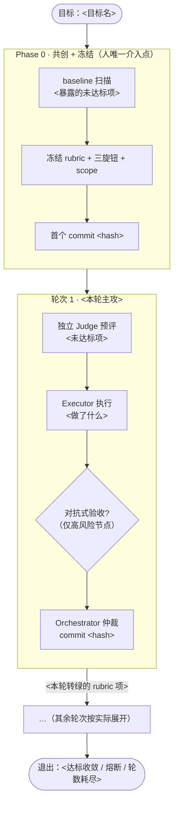

# 运行总览 · <目标名>

> 由收尾步骤在循环结束时自动生成，回答「**过程**：这一程怎么走过来的」。
> 「**结果**：达标没」见 `final-review.md`，逐轮细节见 `log.md`。
> 核心是**流程视角**：用流转图 + 逐轮状态变化讲清任务怎么走的，不要退化成 rubric 打钩清单。

## 一句话摘要
<一句话：什么目标、走了几轮、在哪些转折点拐弯、最终怎么退出。>

| 项 | 值 |
|----|----|
| 最终状态 | 达标收敛 / 停滞熔断 / 轮数耗尽 / 连续失败停机 |
| 停止原因 | （读 `.galatea/stop_reason`） |
| 流程轮次 | Phase 0 → R1 → … → 退出 |
| 起止时间 | <YYYY-MM-DD HH:MM → HH:MM，共 N 分钟>（取首个/末个 commit 时间） |
| commit 链（实质进展） | `<hash>`（冻结）→ `<hash>`（R1）→ … |
| 调用过的资源 | skill / MCP / 工具 / 并行子 agent |

## 任务流转图
> 一眼看清整条路径：人只在 Phase 0 介入一次，此后无人值守跑到退出。
> **菱形 = 对抗式验收闸门**（只在高风险节点升级，是流程真正拐弯处）；箭头标注「这一轮让哪些 rubric 转绿」。
> 按本次实际轮数展开，无对抗升级的轮次就画直线。

## 流程逐轮变化（这一程怎么走的）
> 每个阶段写：**进来什么状态 → 做了什么 → 出去什么状态**。突出转折点（对抗闸门、否决、补修）。

### Phase 0 — 把「什么叫做完」冻成裁判标准 · <HH:MM>
- <baseline 暴露了什么、冻结了哪些标准、首个 commit>
- **流程状态变化**：`无裁判` → `rubric 冻结，oracle 就位`。

### 轮次 1 — <本轮主攻> · <HH:MM>
- <Judge 预评定位 → 行动（并行/对抗）→ 仲裁 → commit>
- **流程状态变化**：`<进来状态>` → `<出去状态>`。

### 轮次 N — … · <HH:MM>
- <按实际轮次续写>

## Rubric 状态流转（红 → 绿，按轮次）
> 横向看每项 rubric 怎么一步步变绿，比单列「最终状态」更能说明流程。
> 🔴 未达标 · 🟡 部分/待复查 · 🟢 达标 · ⚪ 未评

| # | 维度 | 严重度 | Phase 0 | R1 | … |
|---|------|--------|---------|----|----|
| | | | | | |

## 关键机制触发点
> 本次在哪些高风险节点升级了多 agent 对抗 / 竞争式规划，各自如何改变了流程走向。

| 节点 | 升级形态 | 触发原因 | 对流程的影响 |
|------|---------|---------|-------------|
| | 竞争式规划 / 对抗式验收 / 双执行竞标 | | |

## 关键决策与否决
- 被否决的方向（+ 原因）：
- `pending.md` 残留待你处理：

## 结论与残留风险
- 一句话结论：
- 残留风险 / 未尽事项：
- 详见 `final-review.md`（若已收敛）与 `state.md`。
